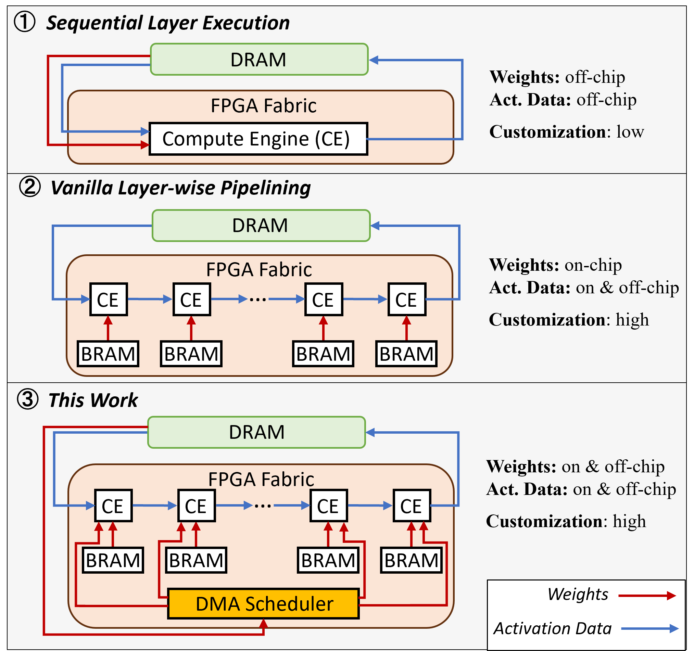

# [AutoWS: Automate Weights Streaming in Layer-wise Pipelined DNN Accelerators](https://arxiv.org/abs/2311.04764)

News: Our paper is accepted by [DATE2024](https://www.date-conference.com/date-2024-accepted-papers) 



# Introduction

This work is an extension to the [fpgaConvNet](https://icidsl.github.io/fpgaconvnet-website) toolflow. We introduce a novel memory management methodology for the layer-wise pipelining architecture, that exploits both on-chip and off-chip memory for weights storage.

# Set up environment
`conda` is required before starts, and then set up the enviornment named `fpgaconvnet-autows` using the following script.
```
source setup.sh
```

# Generate hardware configuration and performance estimation
A python script is available to perform Design Space Exploration (DSE). It takes ~10 mins to finish, and afterwards, the `report.json` and `config.json` shall be found at `./output/resnet18/w4a5_bfp_zcu102` 
```
python example.py --arch resnet18 --device zcu102 --quantization w4a5 --output_path output/resnet18
```


# Interpret predicted results
The `report.json` provides estimations for performance and resource utilization. For example, the accelerator latency estimation can be found as `["network"]["performance"][latency (s)]`.

The `config.json` provides the configuration of the pipeline, and the file will be used to generate the hardware. For the proposed weight streaming methodology, there is a field called `stream_weights` in each convolutional layer, which specifies the depth of weights that are evicted to off-chip.

